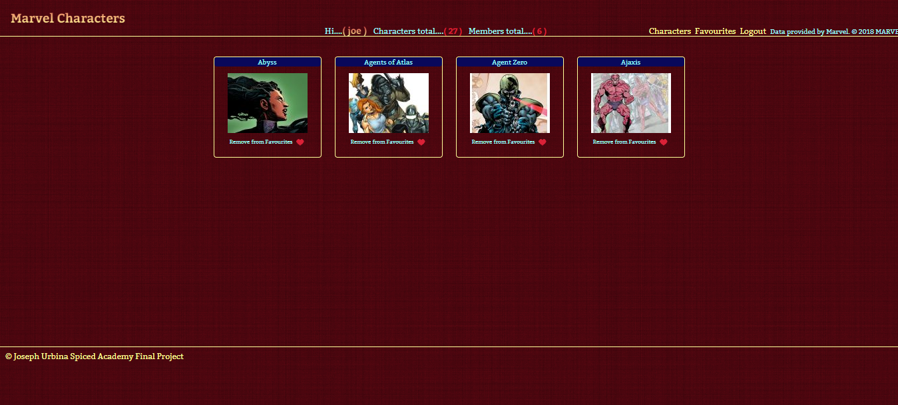

# Marvel Characters
This was my final project at Spiced Academy This project is written in React.js. There are two master apps. Welcome and App. Welcome handles Login and registration. App handles all data from Marvel. There is a search facility on characters. All characters can be clicked on to access the character description, larger image and a link to comics for that character if any. The comics can also be accessed for a description and larger image. Also characters can be added as favourites. These favourites are assigned to the logged on user and can be accessed by a link on the main header. Favourites can be added and removed from the main characters section or removed from the favourites section. There are nearly fifteen hundred Marvel characters so I've limited the initial search to fifty minus those characters without images. I've also added the same functionality to the comics. The header displays the users name, how many characters have been returned on the search and how many users have registered so far. There are also links to get back to the main characters section, a logout link and a link to the favourites section.

# Features

1. Login and Registration.

2. Search facility.

3. Favourites section to record favourite characters.

3. A Postgresql database to record user information.

# Screenshots

